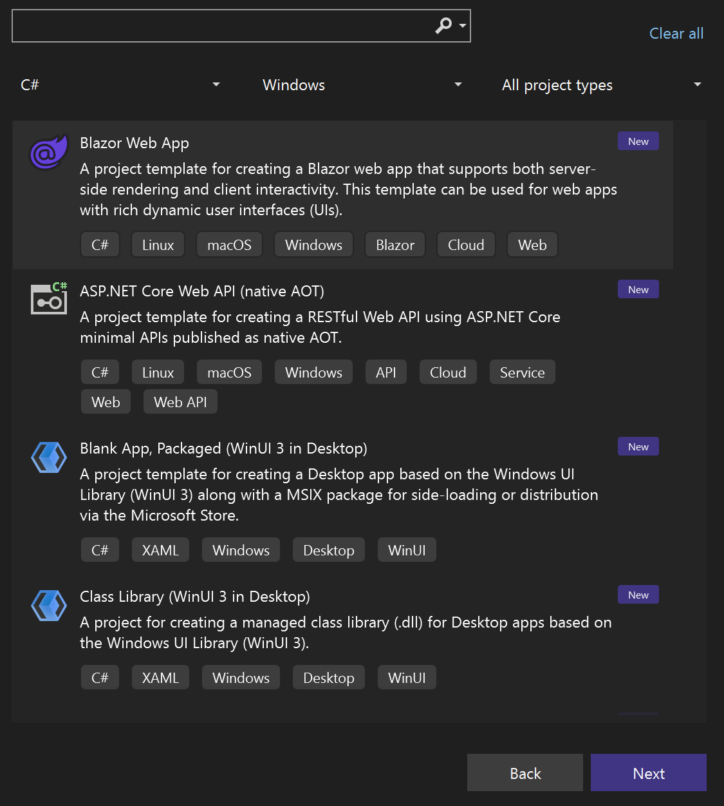
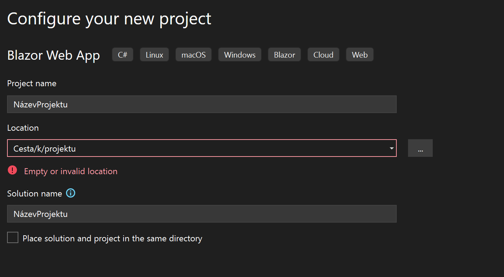
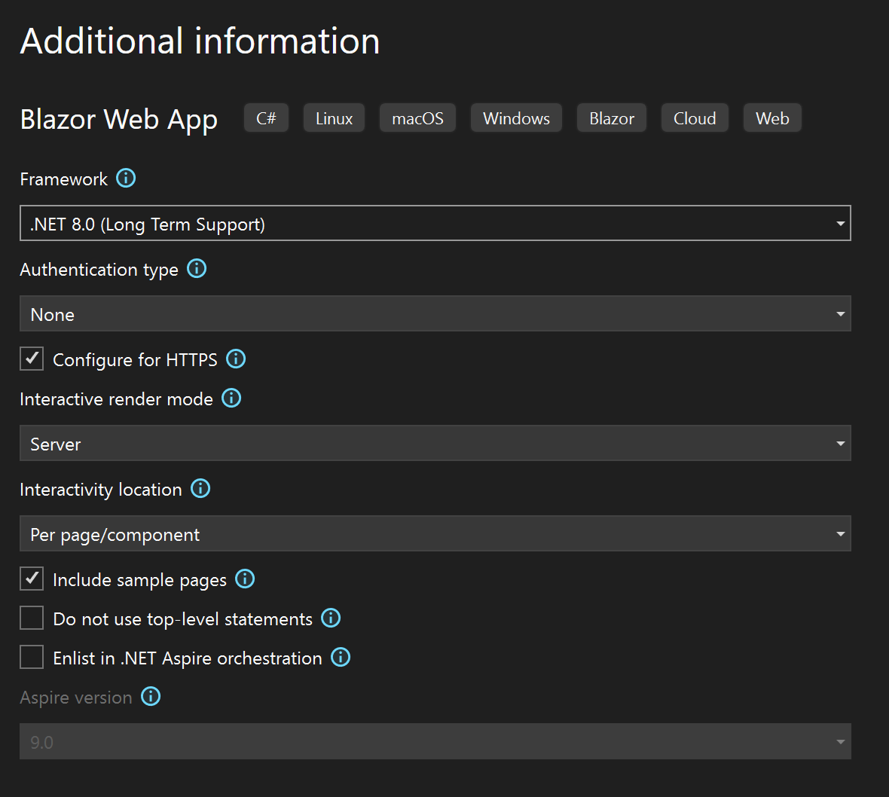
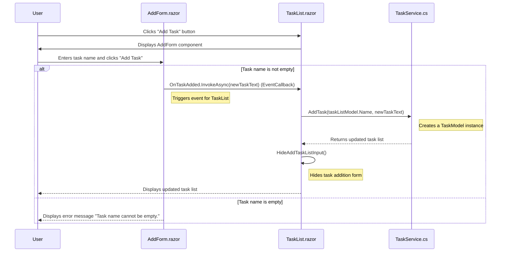

# Project for GUI course focused on .NET Blazor
<details>
<summary>Creating the project using CMD</summary>

```bash
    dotnet new blazor -n [název_projektu] -f net8.0
```

</details>

<details>
    <summary>Creating using Visual Studio</summary>

* Template selection


* Project creation


* Project technical specifications

</details>


# Blazor TODO Application

This application is a simple **TODO list** created in Blazor Server. It allows users to add, edit, delete, and move tasks between lists.

## Requirements
 - .NET 8 SDK
 - IDE or text editor (we recommend VSCode)

### Installation for different operating systems

<details>

<summary>Windows</summary>
    
 - Download: https://dotnet.microsoft.com/en-us/download/dotnet/8.0
 - The installer will handle environment configuration.
 - Verify installation:
```powershell
dotnet --version
```
</details>

<details>
<summary>Linux</summary>

 - Ubuntu/Debian
```bash
sudo apt update && sudo apt install -y dotnet-sdk-8.0
```
 - Arch Linux
```bash
sudo pacman -S dotnet-sdk
```
 - Void Linux
```bash
sudo xbps-install -S dotnet-sdk
```
 - Fedora
```bash
sudo dnf install dotnet-sdk-8.0
```
 - openSUSE
```bash
sudo zypper install dotnet-sdk-8.0
```
 - Ověření instalace
```bash
dotnet --version
```
</details>

<details>
<summary>MacOS</summary>

 - Install .NET 8 SDK
```bash
brew install dotnet-sdk
```
 - Verification
```bash
dotnet --version
```
</details>


## How to Run the Project
1. Clone the repository:
```bash
git clone https://github.com/ValdemarPospisil/Blazor.git
cd Blazor/
```
2. Start the Blazor Server application:
```bash
dotnet watch run
```
3. Open in a browser *http://localhost:5257*

---

## Features
- Add a new task
- Add a new task list
- Edit a task (name, description, deadline)
- Odstranění úkolu
- Delete a task
- Dynamic UI with [Blazor Bootstrap](https://demos.blazorbootstrap.com/buttons)

---

## Project Structure

```plaintext
/Blazor
│── /Components       # UI components and application pages
│   ├── /Layout       # Application layout
│   │   ├── MainLayout.razor
│   │   ├── NavMenu.razor
│   ├── /Pages        # Application pages
│   │   ├── Home.razor        # Main page
│   │   ├── Todo.razor        # TODO application page
│   ├── /Shared       # Shared components
│   │   ├── TaskItem.razor        # Component for individual task
│   │   ├── TaskList.razor        # Component for task list
│   │   ├── AddTaskForm.razor     # Component for adding a task
│   │   ├── TaskItemDetails.razor # Sidebar with task details
│   ├── _Imports.razor  # Global Razor component imports
│   ├── App.razor       # Application root
│   ├── Routes.razor    # Routing definitions
│── /Data              # Data storage and management
│   ├── tasks.json     # JSON file with saved tasks
│── /Models            # Data models
│   ├── TaskListModel.cs  # Model for task lists
│   ├── TaskModel.cs      # Model for individual tasks
│── /Services          # Application logic and services
│   ├── TaskService.cs # Task management (adding, deleting, moving)
│── /wwwroot           # Static files (CSS, images)
│   ├── styles.css     # Custom application styles
│── appsettings.Development.json  # Development settings
│── appsettings.json               # Application configuration
│── BlazorDemo.csproj    # Project file
│── Program.cs           # Application entry point
│── Blazor.sln           # Solution file
```

---

## Sekvenční diagram



---


## Adding Task Moving Functionality Between Lists

In this section, we will add functionality to move tasks between lists in our Blazor application.

### 1. Adding `MoveTask` Method to `TaskService.cs`
First, we will create a method to handle task movement between lists.

**File:** `TaskService.cs`

```csharp
public void MoveTask(TaskModel task, string targetTaskListName)
{
    var sourceTaskList = taskLists.FirstOrDefault(tl => tl.Name == task.TaskListName);

    if (sourceTaskList != null)
    {
        var targetTaskList = taskLists.FirstOrDefault(tl => tl.Name == targetTaskListName);
        if (targetTaskList != null)
        {
            sourceTaskList.Tasks.Remove(task);
            targetTaskList.Tasks.Add(task);
            task.TaskListName = targetTaskListName;
        }
    }
}
```

 - `FirstOrDefault()` → Finds the first matching element in the list or returns `null` if none is found.
 - **Finds the source list** (`sourceTaskList`), where the task currently resides.
 - **Finds the target list** (`targetTaskList`), where the task should be moved.
 - If both lists exist:
     - **Removes the task** from the old list: `sourceTaskList.Tasks.Remove(task);`
     - **Adds the task** to the new list: `targetTaskList.Tasks.Add(task);`
     - **Updates the task’s list name** (`task.TaskListName = targetTaskListName;`)


### 2. Calling `MoveTask` in `Todo.razor`

Now, we will create a method that calls `MoveTask` from `TaskService`.

 **File**: `Todo.razor`

```csharp
private void HandleMoveTask((TaskModel task, string targetTaskList) moveTask)
{
    TaskService.MoveTask(moveTask.task, moveTask.targetTaskList);
}
```
- This method acts as a handler for task movement.


### 3. Adding Move Task Support in `TaskList.razor`
In `TaskList.razor`, we need to pass the `HandleMoveTask` method to child components (`TaskItemDetails`) so that they can trigger the move.

**File**: `TaskList.razor`

```razor
<TaskItemDetails Task="selectedTask" OnClose="CloseDetails" 
                 OnMoveTask="OnMoveTask" OnRemove="RemoveTask" TaskLists="TaskLists" />

@code {
    [Parameter]
    public EventCallback<(TaskModel task, string targetTaskListName)> OnMoveTask { get; set; }
}
```
 - We added a new `[Parameter]` `OnMoveTask`, which allows `TaskItemDetails` to invoke a method in the parent (`TaskList`).

### 4. Implementing Task Movement in  `TaskItemDetails.razor`
In `TaskItemDetails.razor` we need to add a UI for selecting the target list and a button to move the task.

**File**: `TaskItemDetails.razor`

```razor
<div class="task-actions mt-4">
    <div class="mb-3">
        <label class="form-label fw-bold">Move to List</label>
        <div class="d-flex gap-2">
            <select @bind="selectedTaskListName" class="form-select">
                @foreach (var taskList in TaskLists)
                {
                    <option value="@taskList.Name">@taskList.Name</option>
                }
            </select>
            <Button @onclick="MoveTask" Color="ButtonColor.Primary" Size="ButtonSize.Small">
                <i class="bi bi-arrow-right-square me-1"></i> Move
            </Button>
        </div>
    </div>
</div>

@code {
    [Parameter] public TaskModel Task { get; set; }
    [Parameter] public List<TaskListModel> TaskLists { get; set; }
    [Parameter] public EventCallback<(TaskModel task, string targetTaskListName)> OnMoveTask { get; set; }

    private string selectedTaskListName;

    protected override void OnParametersSet()
    {
        if (Task != null)
        {
            selectedTaskListName = Task.TaskListName;
        }
    }

    private async Task MoveTask()
    {
        await OnMoveTask.InvokeAsync((Task, selectedTaskListName));
        await OnClose.InvokeAsync();
    }
}
```
 - The dropdown (`<select>`) contains a list of available `TaskLists` where the task can be moved.
 - The variable `selectedTaskListName` stores the selected target list.
 - Method `MoveTask()`:
     - Calls `OnMoveTask.InvokeAsync()` → assing the task details to the parent (`TaskList`).
     - After a successful move, calls `OnClose.InvokeAsync()`, to close the task details window.
 - Uses `OnParametersSet()` → Whenever the `[Parameter] Task`, changes, it updates  `selectedTaskListName` to the task’s current list.


---

# Exercise 1: Notepad

### Task:
Create a new Blazor page that allows the user to:
1. **Add** a new note.
2. **View** created notes.
3. **Remove** an existing note.
4. **Edit** an existing note.


<details>
  <summary>💡 Hint</summary>

- Use **`@bind`** for two-way data binding.
- Store notes in a **`List<string>`** and render them using **`@foreach`**.
- Everything can be done in a single Razor page.
</details>

<details>
    <summary>Partial Solution</summary>
    
```razor
@page "/notepad"
<PageTitle>Notepad</PageTitle>
<h3>Notepad</h3>

<div class="mb-3">
    <TextAreaInput/>
    <Button>Add</Button>
</div>

<div class="mb-3"></div>
<ul class="list-group">
    @foreach (var note in Notes)
    {
        <li class="list-group-item d-flex justify-content-between align-items-center">
            @if (note.IsEditing)
            {
                <TextInput/>
                <Button>Save</Button>
            }
            else
            {
                <div class="note-text">
                    @note.Text
                </div>
                <div>
                    <Button>✏️</Button>
                    <Button>🗑️</Button>
                </div>
            }
        </li>
    }
</ul>

@code {
    private List<Note> Notes = new();
    private string newNoteText = "";
 
    private void AddNote()
    {
        ...
    }

    private void RemoveNote(Note note)
    {
        ...
    }

    private void EditNote(Note note)
    {
        ...
    }

    private void SaveEdit(Note note)
    {
        ...
    }

    private class Note
    {
        ...
    }
}

<style>
    .note-text {
        max-height: 100px; 
        overflow: auto;
        white-space: pre-wrap;
        word-wrap: break-word;
    }
</style>
```
</details>

---
# Exercise 2: Stopwatch
### Task:
Create a Blazor page that allows the user to:
1. **Start/Stopt** the stopwatch.
2. **Reset the time** on the stopwatch.
3. **Record and display** lap times.
4. **Delete** individual lap times or all at once.

<details>
  <summary>💡 Hint</summary>
    
- Use `System.Timers.Timer` for updating time.
- Stopwatches can store elapsed time using  `TimeSpan`.
- Use `List<string>` to display lap times.
</details>


<details>
    <summary>Partial Solution</summary>

```razor
@page "/stopwatch"
@rendermode InteractiveServer

<PageTitle>StopWatch</PageTitle>

<h3 style="text-align: center;">⏱ Stopwatch</h3>

<div class="stopwatch">
    <p>Time: ...</p>

    <button>
        @(isRunning ? "⏸ Pause" : "▶ Start")
    </button>
    <button>⏹ Reset</button>
    <button>📍 Add Lap</button>
    <button>Clear Laps</button>

    @if (laps.Count > 0)
    {
        <h4>Laps:</h4>
        <ul>
            @foreach (var lap in laps)
            {
                <li>
                    @lap
                    <button @onclick="() => RemoveLap(lap)">🗑</button>
                </li>
            }
        </ul>
    }
</div>


@code {
    private bool isRunning = false;
    private TimeSpan elapsed = TimeSpan.Zero;
    private System.Timers.Timer timer;
    private DateTime startTime;
    private List<string> laps = new();

    private string formattedTime => elapsed.ToString(@"hh\:mm\:ss\.ff");

    protected override void OnInitialized()
    {
        ...
    }

    private void ToggleTimer()
    {
        ...
    }

    private void OnTimerElapsed(object? sender, System.Timers.ElapsedEventArgs e)
    {
        ...
    }

    private void Reset()
    {
        ...
    }

    private void AddLap()
    {
        ...
    }

    private void RemoveLap(string lap)
    {
        ...
    }

    private void ClearLaps()
    {
        ...
    }

    public void Dispose()
    {
        ...
    }
}


<style>
    .stopwatch {
        max-width: 500px;
        margin: 20px auto;
        padding: 20px;
        background: #f5f5f5;
        border-radius: 10px;
        box-shadow: 0 0 10px rgba(0,0,0,0.1);
        font-family: Arial, sans-serif;
    }

    .stopwatch p {
        font-size: 2em;
        text-align: center;
        margin: 10px 0;
    }

    .stopwatch button {
        margin: 5px;
        padding: 8px 12px;
        font-size: 1em;
        border: none;
        border-radius: 5px;
        background-color: #007bff;
        color: white;
        cursor: pointer;
    }

    .stopwatch button:disabled {
        background-color: #aaa;
        cursor: not-allowed;
    }

    .stopwatch ul {
        list-style-type: none;
        padding: 0;
    }

    .stopwatch li {
        margin: 5px 0;
        padding: 5px;
        background-color: #eee;
        display: flex;
        justify-content: space-between;
        align-items: center;
        border-radius: 5px;
    }

    .stopwatch li button {
        background-color: #dc3545;
        padding: 4px 8px;
        font-size: 0.9em;
    }
</style>

```
</details>

---
# Exercise 3: Image Carousel
### Task:
Create a Blazor page that:
1. **Automatically changes images** every 3 seconds.
2. **Allows manual switching** between images with buttons.
3. **Loads images** from a specified folder (`wwwroot/images/gallery`)
4. **Supports infinite cycling** – transitions from the last image to the first and vice versa.


<details>
  <summary>💡 Hint</summary>
    
- Use `System.Timers.Timer` for automatic switching.
- Adjust image paths to be relative (`/images/gallery/image.jpg`)
- `StateHasChanged()` will trigger component re-rendering when the image changes.
- Dispose of the timer in `Dispose()` to prevent memory leaks..
</details>


<details>
  <summary>Partial Solution</summary>

**1. Create a Component (`ImageCarousel.razor`)**

```razor
@inject IWebHostEnvironment env  

<div class="carousel">  
    <button class="prev" @onclick="Previous">❮</button>  
      
    <button class="next" @onclick="Next">❯</button>  
</div>  
```
**2. Component Logic (`@code blok`)**

```razor
@code {  
    [Parameter]  
    public string WorkFolder { get; set; } = "images/gallery";  

    private int activeIndex = 0;  
    private List<string> images = new();  
    private System.Timers.Timer? timer;  

    protected override void OnInitialized()  
    {  
        string fullPath = Path.Combine(env.WebRootPath, WorkFolder.Replace("/", Path.DirectorySeparatorChar.ToString()));  
        if (Directory.Exists(fullPath))  
        {  
            images = Directory.GetFiles(fullPath, "*.jpg").Select(img =>  
                Path.Combine("/", WorkFolder, Path.GetFileName(img))).ToList();  
        }  

        timer = new System.Timers.Timer(3000);  
        timer.Elapsed += (sender, e) => InvokeAsync(Next);  
        timer.AutoReset = true;  
        timer.Start();  
    }  

    private void Next()  
    {  
        ...;
    }  

    private void Previous()  
    {  
        ...;
    }  

    private void RestartTimer()  
    {
        ...;
    }  

    public void Dispose() => timer?.Dispose();  
}  
```

**3. Styling(`<style>`)**
```css
<style>  
    .carousel {  
        position: relative;  
        width: 800px;  
        height: 400px;  
        margin: auto;  
        overflow: hidden;  
    }  

    .carousel-image {  
        width: 100%;  
        height: 100%;  
        object-fit: cover;  
        border-radius: 10px;  
    }  

    .prev,  
    .next {  
        position: absolute;  
        top: 50%;  
        transform: translateY(-50%);  
        background: rgba(0, 0, 0, 0.5);  
        color: white;  
        border: none;  
        padding: 10px;  
        cursor: pointer;  
        font-size: 20px;  
    }  

    .prev {  
        left: 10px;  
    }  

    .next {  
        right: 10px;  
    }  
</style>  
```
</details>

---

# Exercise 4: Image Gallery
### Task:
Create a Blazor page that allows you to:
1. **Load** images
2. **Render** images
3. **View a specific image**
4. **Navigate images using keyboard controls**
4. **Subtask**: Implement a masonry layout using Blazor and pure CSS


<details>
  <summary>💡 Hint</summary>

- Load images using a Service and render them using a loop in HTML tags.
- Use an overlay to display a selected image on top of the existing gallery.
- For keyboard controls, register key inputs using KeyboardEventArgs.
</details>

<details>
  <summary>Část řešení</summary>

**1. Create a Razor page where we will use our gallery component**
```razor
@page "/gallery"

<h3>Galerie</h3>

<ImageGrid />
```

2. **Create the `ImageGrid.razor` component**

    - The name is optional, but make sure to update the reference in the previous step accordingly.

    <details>
        <summary>Code</summary>

    ```csharp
    @code {
        private List<string> images = new List<string>();
        private int selectedIndex = -1;
        private ElementReference overlayElement;
        private string? path;


        protected override async Task OnInitializedAsync()
        {
            ...;
        }

        private async Task OpenImage(int index)
        {
            ...;
        }

        private async Task FocusOverlay()
        {
            ...;
        }

        private void CloseImage()
        {
            ...;
        }

        private void PreviousImage()
        {
            ...;
        }

        private void NextImage()
        {
            ...;
        }

        private async Task HandleKeyDown(KeyboardEventArgs e)
        {
            ...;
        }
    }
    ```
    </details>

    ### Let's break down the code:

    **`OnInitializedAsync`**
    - Automatically runs when the component initializes.

    **`OpenImage`**
    - Opens the selected image in an overlay.

    **`FocusOverlay`**
    - Focuses the overlay element to enable keyboard navigation.

    **`CloseImage`**
    - Closes the image overlay.

    **`PreviousImage`**
    - Moves selection to the previous image.

    **`NextImage`**
    - Moves selection to the next image.

    **`HandleKeyDown`**
    - Handles keyboard input when the overlay is active.

3. **Structure the page within the component**

    <details>
        <summary>Code</summary>


    ```csharp
    @if (images.Count == 0)
    {
        <p>Žádné obrázky nejsou k dispozici.</p>
    }
    else
    {
        <div class="gallery">
            @foreach (var img in images.Select((path, index) => new { path, index })) 
            {
                <div class="gallery-item">
                     OpenImage(img.index)" />
                </div>
            }
        </div>
    }

    @if (selectedIndex != -1)
    {
        <div class="gal-overlay" tabindex="0" @onkeydown="HandleKeyDown" @ref="overlayElement">
            <button class="gal-nav-btn left" @onclick="PreviousImage">&#9665;</button>

            

            <button class="gal-nav-btn right" @onclick="NextImage">&#9655;</button>
        </div>
    }
    ``` 
    </details>

4. **Define the page styling in the component:**


    <details>
        <summary>Code</summary>

    ```css
    <style>
        .gallery {
            column-count: 5;
            column-gap: 1rem;
            padding: 1rem;
        }
        @@media (max-width: 1200px) {
            .gallery {
                column-count: 4;
            }
        }

        @@media (max-width: 992px) {
            .gallery {
                column-count: 3;
            }
        }

        @@media (max-width: 768px) {
            .gallery {
                column-count: 2;
            }
        
        }

        .gallery-item {
            break-inside: avoid;
            margin-bottom: 1rem;
            background-color: #f8f8f8;
            border-radius: 0.5rem;
            overflow: hidden;
            box-shadow: 0 2px 8px rgba(0, 0, 0, 0.1);
        }

        .gallery-item img {
            width: 100%;
            display: block;
        }

        .gallery img {
            transition: transform 0.2s;
        }

        .gallery img:hover {
            transform: scale(1.05);
        }

        .gal-overlay {
            position: fixed;
            top: 0;
            left: 0;
            width: 100%;
            height: 100%;
            background: rgba(0, 0, 0, 0.8);
            display: flex;
            align-items: center;
            justify-content: center;
        }

        .gal-overlay img {
            max-width: 80%;
            max-height: 80%;
            border-radius: 10px;
        }

        .gal-nav-btn {
            position: absolute;
            top: 50%;
            transform: translateY(-50%);
            background: rgba(255, 255, 255, 0.5);
            border: none;
            font-size: 24px;
            cursor: pointer;
            padding: 10px;
            border-radius: 50%;
        }

        .gal-nav-btn.left {
            left: 20px;
        }

        .gal-nav-btn.right {
            right: 20px;
        }
    </style>
    ```
    </details>
