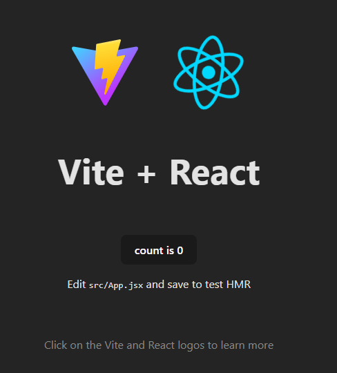

# React Quiz App - Step-by-Step Guide  

## Pøíprava projektu  
### Proè použít Vite?
* Rychlejší setup a build time díky tomu, že používá ES modules (ESM).
* Instant Hot Module Replacement (HMR)
* Jednoduchá konfigurace (pouze `vite.config.js`)
### 1. Vytvoøení React aplikace:  
   ```sh
   npm create vite@latest quiz-app -- --template react
   cd quiz-app
   npm install
   npm run dev
   ```
Program nyní bìží na adrese [http://localhost:5173](http://localhost:5173)


### 2. Struktura projektu a úprava souborù

