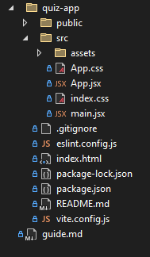

# React Quiz App - Step-by-Step Guide  

## Motivace

### Proè React?

#### 1. Snadná tvorba interaktivních aplikací
* React umožòuje vytváøet rychlé, dynamické a interaktivní uživatelské rozhraní.
* Komponentový pøístup – aplikaci rozložíte na malé, znovupoužitelné èásti (napø. `Quiz`, `Question`, `Button`).
* Jednoduché spravování stavu aplikace pomocí `useState` a `useEffect`.

#### 2. Rychlý a efektivní díky Virtual DOM
* React nepøepisuje celý HTML kód pøi každé zmìnì, ale chytøe aktualizuje jen zmìnìné èásti díky Virtual DOM.
* Výsledkem je rychlejší a efektivnìjší aplikace oproti klasickému manipulování s `document.getElementById()`.

#### 3. Snadná rozšiøitelnost a ekosystém
* React má obrovskou komunitu, což znamená hodnì návodù, knihoven a nástrojù.
* Lze ho propojit s dalšími technologiemi, jako je Redux, TailwindCSS, Firebase, MongoDB, Express.js.
* React Native umožòuje psát mobilní aplikace stejnou syntaxí jako webovou aplikaci!

#### 4. Použití ve firmách a reálných projektech
* Velké firmy jako Meta, Netflix, Airbnb, Spotify, Uber používají React.
* Pokud plánujete kariéru v programování, znalost Reactu zvýší vaše šance na zamìstnání.

### Proè použít Vite?
* Rychlejší setup a build time díky tomu, že používá ES modules (ESM).
* Instant Hot Module Replacement (HMR)
* Jednoduchá konfigurace (pouze `vite.config.js`)

## Pøíprava projektu  

### 1. Vytvoøení React aplikace:  
   ```sh
   npm create vite@latest quiz-app -- --template react
   cd quiz-app
   npm install
   npm run dev
   ```
Program nyní bìží na adrese [http://localhost:5173](http://localhost:5173):


### 2. Struktura projektu a úprava souborù

